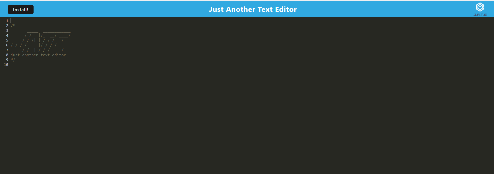

# Text-Editor
The application is a web text editor where the user can create notes or code snippets with or without an internet connection and where the user can reliably retrieve them for later use. The integrated service worker and Cache API's ensure that the application will remain fully functional even without and active internet connection. This application allows the user to access visited pages even if the application is offline.

## Table of Contents
- [Instructions](#instructions)
- [Usage Information](#usage-information)
- [Deploy Link](#deploy-link)
- [Built With](#built-with)
- [Question](#question)

## Instructions
- clone this repository.
- Download Node.js at [https://nodejs.org/en/download/](https://nodejs.org/en/download/)
- Using npm to install required node modules by using **npm install** in the command line.

## Usage Information
Run `npm run start` in the command line 

## Deploy Link
🚀The application has been deployed to Heroku and the URL of the deployed application is:
[https://van-jate.herokuapp.com/](https://van-jate.herokuapp.com/)

## Built With
- Babel
- Express.js
- IndexedDB
- Webpack

## Question
If you have any additional questions about this project, Feel free to reach me at [vantam8300@gmail.com](vantam8300@gmail.com).
For more of my project, please visit [https://github.com/vantam8300](https://github.com/vantam8300)